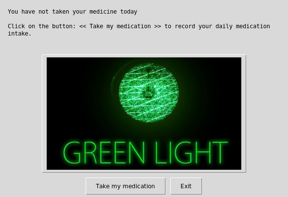

[](https://awesome.re)  

# DailyMed
  

## What's this software ?  

This Python 3 software help the people who have to take a medecation 
everyday. You need Python3 and the easygui library to run it.

  


## What you need to make it work :  

The last version of Python 3.

you also need to have the easygui library for python 3:

At least the version 0.98

```sh
sudo python3 -m pip install --upgrade easygui 
```


## How to launch this game :  

```sh
python3 radio.py
```  


## Developer - Author

Hamdy Abou El Anein

## Homepage

http://www.daylightlinux.ch 
